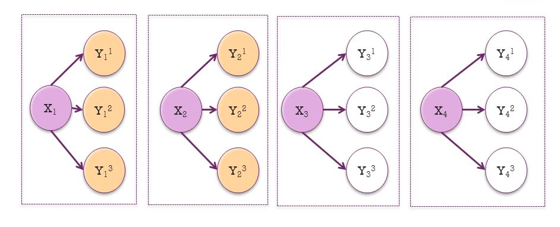

# Awesome-Multi-label-classification-papers

  

##### Table of Contents

1. [Papers](#NLP-papers)  
2. [Code](#multi-label-classification)
3. [datasets](#datasets)
4. [Tutorials](#Tutorials)
5. [Researchers](#Researchers)

## Natural language processing

## Papers

- **Multi-Label Classification: An Overview**
  - Grigorios Tsoumakas, Ioannis Katakis 
  - [[Paper]](http://citeseerx.ist.psu.edu/viewdoc/summary?doi=10.1.1.104.9401)
  
- **Multilabel text classification for automated tag suggestion**
  - Ioannis Katakis, Grigorios Tsoumakas, and Ioannis Vlahavas
  - [[Paper]](https://www.kde.cs.uni-kassel.de/ws/rsdc08/pdf/9.pdf)

- **Multi-label text classification with a mixture model trained by EM**
  - Andrew McCallum
  - [[Paper]](https://mimno.infosci.cornell.edu/info6150/readings/multilabel.pdf)

- **Large-Scale Multi-label Text Classification — Revisiting Neural Networks**
  - Jinseok NamJungi, KimEneldo Loza MencíaIryna, Gurevych, Johannes Fürnkranz
  - [[Paper]](https://arxiv.org/pdf/1312.5419)

- **Effective multi-label active learning for text classification**
  - Yang, Bishan and Sun, Jian-Tao and Wang, Tengjiao and Chen, Zheng
  - [[Paper]](https://dl.acm.org/citation.cfm?id=1557119)
  
- **Classifier chains for multi-label classification**
  - Jesse Read, Bernhard Pfahringer, Geoff Holmes, and Eibe Frank
  - [[Paper]](https://link.springer.com/content/pdf/10.1007/978-3-642-04174-7_17.pdf)
  
  
## Code

- **Multi-Label Text Classification**
   - [[Code]](https://github.com/RandolphVI/Multi-Label-Text-Classification)
   
- **Deep neural network framework for multi-label text classification**
   - [[Code]](https://github.com/inspirehep/magpie)
   
- **Bert Multi-Label Text Classification**
   - [[Code]](https://github.com/lonePatient/Bert-Multi-Label-Text-Classification)
   
   

